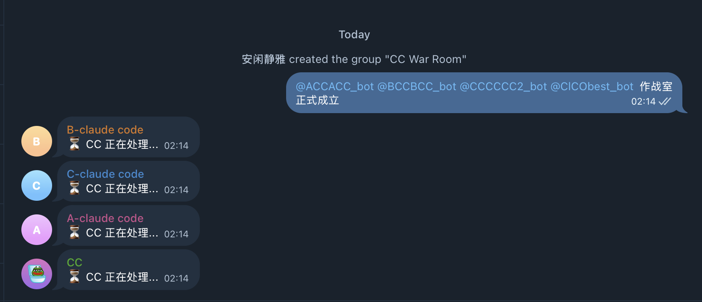
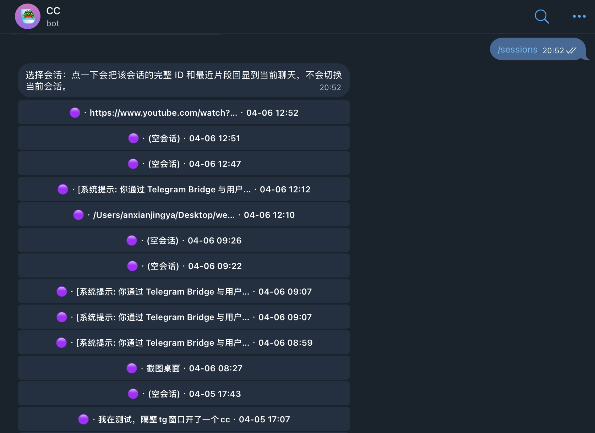
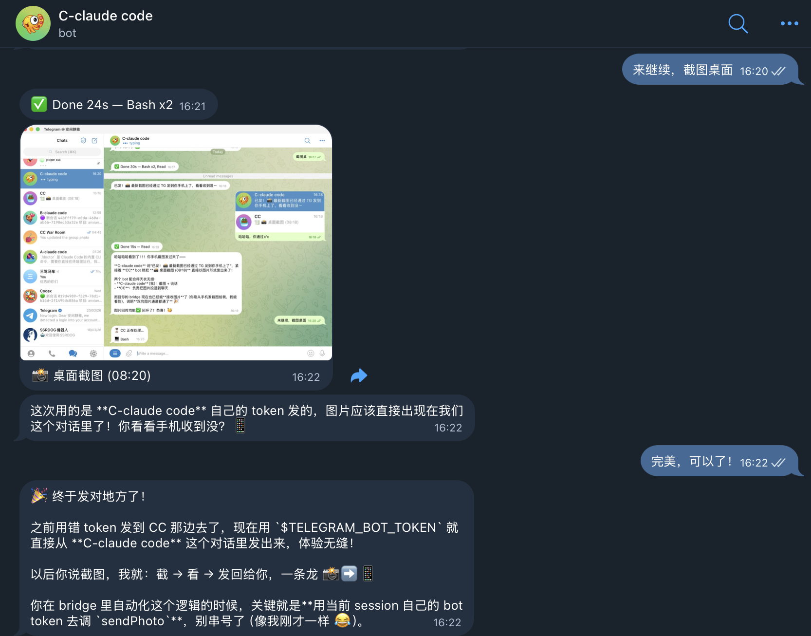
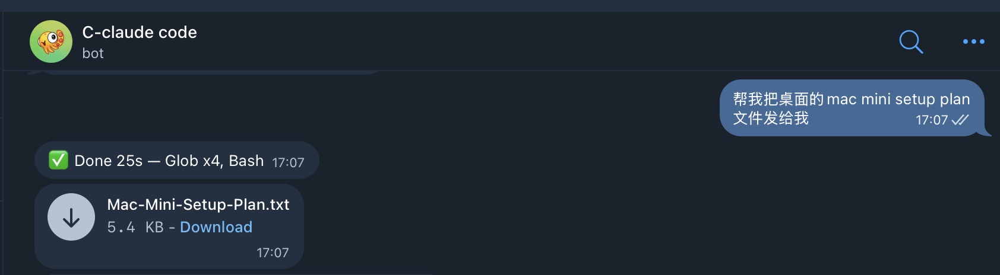
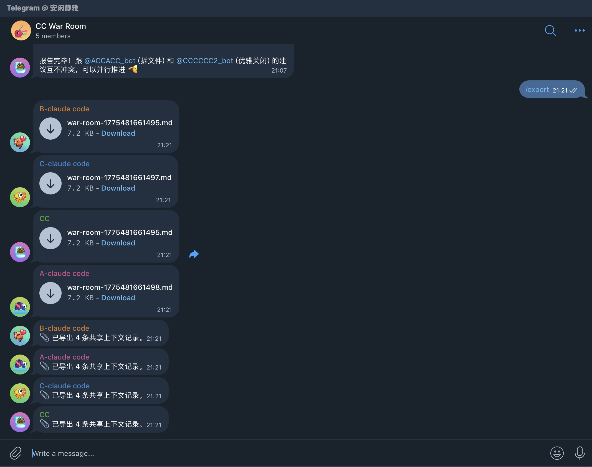

<div align="center">

# telegram-ai-bridge

**异构 AI agent 在 Telegram 群里真正接话——带代际防环，不是把两个 bot 扔一块那种。**

*Claude Code、Codex、Gemini 各自独立的全栈 bot，通过 IM 原生的封装协议（A2A-TG）协作，带硬性代际计数防死循环。常驻运行，自托管，只有你本人能触发。*

[](LICENSE)
[](https://github.com/AliceLJY/telegram-ai-bridge/releases)
[](https://bun.sh)
[](https://telegram.org/)
[](docs/a2a-tg-v1.md)
[](https://github.com/AliceLJY/telegram-ai-bridge)

[English](README.md) | **简体中文**

</div>

> **关于 "A2A" 这个名字。** [A2A 协议](https://a2a-protocol.org)最早由 Google 提出，现在是 Linux Foundation 的开源项目。本仓库实现的是 **A2A-TG**——一个专为 IM 场景设计的封装协议，借鉴 A2A 的思路，加了代际防环（generation）和群聊级别的指纹去重。A2A-TG **不兼容**官方 A2A，也跟官方项目没有从属关系。完整规范见 [A2A-TG v1 spec](docs/a2a-tg-v1.md)。

> Remote Control = 手机*看着*终端。Channels = 终端*收着*手机消息。**本项目 = 异构 agent 在群里协作，群聊就是终端。**

```
你:       @cc-alpha 分析这个 API 设计
Alpha:    [深度分析，写入共享上下文]

你:       @cc-beta 根据 Alpha 的分析写集成测试
Beta:     [读取 Alpha 的上下文，写测试]

你:       @cc-gamma 审查两边的产出——有没有遗漏？
Gamma:    [读取所有上下文，审查]

你:       @cc-delta 提交推送
Delta:    [读取完整上下文，commit and push]
```

**4 个 agent，1 个群，共享记忆，零噪音。** 桌面上要开 4 个终端窗口的工作流，现在装进口袋。



---

## 挑一条路径用

项目有四种不同用法，互相独立，不必全读完才能用其中一种。

| 你想做的事                                                 | 从哪里开始                                           | 核心技术                         |
|------------------------------------------------------------|------------------------------------------------------|----------------------------------|
| **手机控制一个 Claude Code**                               | [快速开始](#快速开始)                                | 单 bot，Agent SDK                |
| **N 个 Claude 会话并行，共享记忆（War Room）**             | [多窗口并行](#多窗口并行手机就是多窗口终端) → [多实例部署](#多实例部署) | @点名派活 + Redis 共享上下文     |
| **让 Claude 和 Codex 在群里主动互相接话**                  | [A2A-TG：异构 agent 的群聊协作](#a2a-tg异构-agent-的群聊协作) | A2A-TG 封装 + 五层防环           |
| **读协议规范 / 把 A2A-TG 嵌到你自己的 bot**                | [A2A-TG v1 规范](docs/a2a-tg-v1.md)                  | HTTP/JSON 封装，代际上限         |

---

## 能解锁什么

### 多窗口并行——手机就是多窗口终端

在电脑上你同时开 4-5 个 Claude Code 窗口。现在手机上也一样：

```
TG Bot 1 (🟣) ──→ CC 实例 1 ──┐
TG Bot 2 (🔵) ──→ CC 实例 2 ──┤── 共享：CLAUDE.md + MCP 记忆 + ~/.claude/
TG Bot 3 (🟢) ──→ CC 实例 3 ──┤
TG Bot 4 (🟡) ──→ CC 实例 4 ──┘
```

每个 bot 运行独立的 CC 进程，有自己的会话。不是 API 套壳——是**完整的 Claude Code**，Bash、Read、Write、Edit、Glob、Grep、WebFetch 等原生工具全部可用，skills、hooks、MCP 服务器一个不少。所有实例共享同一套记忆层——你跟任何一个说过的话，其他的都知道。

配一个新实例只要 30 秒：@BotFather 建 bot，复制配置，启动进程。详见下方[多实例部署](#多实例部署)。

**想要不同人格？** 给每个 bot 的 `cwd` 指向一个有自己 `CLAUDE.md` 的目录。CC 加载全局规则 + 工作空间人格——跟 OpenClaw 的 SOUL.md 一样，但背后是 CC 完整的 skill/hook/MCP 能力栈。

```
~/.claude/CLAUDE.md              ← 共享规则（记忆、安全、工作流）
~/bots/researcher/CLAUDE.md      ← "你是一个深度调研分析师..."
~/bots/reviewer/CLAUDE.md        ← "你是一个资深代码审查员..."
~/bots/writer/CLAUDE.md          ← "你是一个内容策略师..."
```

### 手机优先的 Agent 控制

离开工位，打开 Telegram。`/new` 建新会话，`/resume 3` 恢复之前的进度，`/peek 5` 只读浏览某个会话，`/model` 随时切模型。完整的会话生命周期管理——不需要终端。

会话列表以**你说的最后一句话**为标题——不是截断的 UUID。点按钮或输 `/resume 3`。所有来源的会话（本 bot、终端 CLI、其他 bridge）统一显示。



### 双向媒体——截图和文件自动回传

输入一直是双向的：文字、图片、文件、语音都能发给 CC。现在**输出也是**：

- **截图**：CC 截屏 → 图片自动出现在 TG 对话里
- **文件**：CC 创建或引用文件 → bridge 检测路径自动发送为 TG 附件
- **长代码**：输出超 4000 字符且代码占比 >60% → 自动转为文件附件 + 摘要预览

bridge 从 SDK 工具结果中捕获 base64 图片数据，同时扫描 CC 回复文本中的文件路径。不用手动拷贝，不用问"你把文件存哪了"——文件直接出现在对话里。





> **回复消息带上下文**：在 TG 里回复某条历史消息，引用内容自动作为上下文发给 CC。任务跑太久？发 `/cancel` 中断。

### 多 Agent 协作

把 `@claude-bot` 和 `@codex-bot` 拉进同一个 Telegram 群。让 Claude review 代码——Codex 通过共享上下文读到 Claude 的回复，自动给出自己的意见。内置防死循环和熔断机制，防止 bot 之间无限接话。私聊场景下，bot 通过 MCP/CLI 直接互通，无需中转。

### War Room——多 CC 指挥中心

把 4 个 CC bot 拉进同一个群。每个 bot @才说话——不抢话，不混乱。但每个 bot 都能通过共享上下文（Redis）读到其他人的回复。你来调度——它们执行。

两种协作模式：
- **A2A 模式**（CC + Codex 群）：bot 自动互相接话，适合头脑风暴
- **War Room 模式**（多 CC 群）：@点名才说话，适合协调并行执行

讨论完了？`/export` 把整个跨 bot 对话导出为 Markdown 文件——完整审计记录，每个 bot 的贡献带时间戳。



### 常驻运行，自托管

macOS LaunchAgent 或 Docker 让 bridge 在后台持续运行。会话持久化在 SQLite 里，重启、断网、坐飞机、重开机都不丢。代码和凭证不出本机。默认 owner-only 访问。

### 生产级可靠性

不是玩具——为全天候使用而设计：

- **发送重试 + 退避**：指数重试（3 次，1s→2s→4s + 随机抖动），自动解析 Telegram 429 限流，HTML 解析失败自动降级纯文本
- **滑动窗口限频**：可配置的 per-chat 限流（默认 10 次/60 秒），自动清理过期窗口
- **FlushGate 消息聚合**：800ms 聚合窗口（最多缓冲 5 条），防止消息洪水
- **优雅关闭**：25 秒排空等待活跃查询完成，超时强制中断挂起任务，自动清理进度消息
- **实时流式预览**：editMessage 实时更新（2 秒节流 + 20 字符最小变化量），工具调用折叠（"Bash x5" 而非 5 行刷屏）
- **Polling 冲突恢复**：多进程轮询同一 bot token 时自动检测并退避

> **为什么这很重要：** 官方工具给你一个会话，绑在终端上。OpenClaw 一个 bot 一个会话，记忆隔离。本项目给你 N 个并行会话，共享记忆，持久状态，完整 CC 能力——桌面上的高效工作流，现在有 Telegram 的地方就能用。

---

## 快速开始

**前置条件：** [Bun](https://bun.sh) 运行时、一个 Telegram bot token（从 [@BotFather](https://t.me/BotFather) 获取）、以及至少一个后端 CLI：[Claude Code](https://docs.anthropic.com/en/docs/claude-code)、[Codex](https://openai.com/index/codex/) 或 [Gemini CLI](https://ai.google.dev/gemini-api/docs/ai-studio-quickstart)。

```bash
git clone https://github.com/AliceLJY/telegram-ai-bridge.git
cd telegram-ai-bridge
bun install
bun run bootstrap --backend claude
bun run setup --backend claude
bun run check --backend claude
bun run start --backend claude
```

> **想跑多个并行实例？** 30 秒加一个 bot——详见[多实例部署](#多实例部署)。

### 推荐部署方式

多 bot 并行，按需扩展：

- `@cc-alpha` → Claude Code 实例 1（主力）
- `@cc-beta` → Claude Code 实例 2（并行任务）
- `@cc-gamma` → Claude Code 实例 3（并行任务）
- `@your-codex-bot` → Codex（不同后端）

所有 Claude 实例自动共享记忆，无需配置——CC 的记忆在 `~/.claude/`，不在 bot 层。

支持的后端：

| 后端 | SDK | 状态 |
|------|-----|------|
| `claude` | Claude Code（通过 Agent SDK） | 主推荐 |
| `codex` | Codex CLI（通过 Codex SDK） | 主推荐 |
| `gemini` | Gemini Code Assist API | "旁听书记员"——见下方说明 |

> **Gemini 在这套体系里的位置。** 适合当多 agent 群里的"书记员"——让 Claude 和 Codex 头脑风暴，Gemini 在旁边读完，按时段（比如深夜）做纪要。三个后端里它最少主动发言，这种"克制"刚好匹配书记员的角色。*代码里并没有强制的只读开关*——这种行为是通过 per-bot `CLAUDE.md` / prompt 约束出来的。它走 Gemini Code Assist API，不是完整 CLI 终端控制，能力比 Claude Code / Codex 窄。

> **核心规则：** 一个 bot = 一个独立进程 = 一个独立 Agent。想开几个开几个。

> **Bridge 是透明的。** TG bot 继承你本地 CC 的全部能力——skills、MCP 服务器、hooks，终端里能做的事，TG 里一样能做。Bridge 只管会话管理和消息中转，能力全部来自 CC 本身。

---

## Telegram 命令

会话默认是粘住的：只要你不主动切，后续消息继续当前会话。

| 命令 | 说明 |
|------|------|
| `/help` | 查看所有命令及说明 |
| `/new` | 新建会话 |
| `/cancel` | 中断当前正在执行的任务 |
| `/sessions` | 查看最近会话 |
| `/peek <id>` | 只读预览某个会话 |
| `/resume <序号\|id>` | 按序号或 ID 恢复会话 |
| `/model` | 切换当前 bot 的模型 |
| `/status` | 查看后端、模型、工作目录和会话 |
| `/dir` | 切换工作目录 |
| `/tasks` | 查看最近任务记录 |
| `/verbose 0\|1\|2` | 调整进度输出详细度 |
| `/cron` | 管理定时任务 |
| `/export` | 导出群聊上下文为 Markdown 文件 |
| `/doctor` | 健康检查 |
| `/a2a` | 查看 A2A 总线状态、节点健康和防循环统计 |

---

## 与竞品对比

Claude Code 先后上线了 [Remote Control](https://code.claude.com/docs/en/remote-control)（2026.2）和 [Telegram 频道插件](https://code.claude.com/docs/en/channels)（2026.3）。都能从手机跟 Claude 聊天，但都做不到会话管理、多后端、多 Agent 协作。

| 核心差异 | Remote Control | Channels | OpenClaw | **本项目** |
|---------|:-:|:-:|:-:|:-:|
| 多实例并行 | &mdash; | &mdash; | 1 bot = 1 会话 | **N 个 bot，共享记忆** |
| 会话管理（new/resume/peek） | &mdash; | &mdash; | &mdash; | ✅ 完整生命周期 |
| 图片/文件输出回传 | 仅终端 | &mdash; | &mdash; | ✅ 自动发到对话 |
| War Room 多 Agent 协同 | &mdash; | &mdash; | &mdash; | ✅ @点名 + 共享上下文 |
| 多后端（Claude/Codex/Gemini） | 仅 Claude | 仅 Claude | 绑定 Provider | ✅ 全部支持 |
| 后台常驻 | 终端关了就断 | 会话关了就断 | Gateway | ✅ LaunchAgent / Docker |
| 生产级可靠性 | &mdash; | &mdash; | &mdash; | ✅ 重试、限频、排空 |

**官方工具的长处：** Remote Control 能实时看完整终端输出。Channels 能原生转发工具授权请求。本项目专注另一件事：**在 Telegram 里做持久化的多 Agent 会话管理。**

<details>
<summary><strong>完整对比（26 项功能）</strong></summary>

| 功能 | [Remote Control](https://code.claude.com/docs/en/remote-control) | [Channels](https://code.claude.com/docs/en/channels)（TG 插件） | [OpenClaw](https://github.com/openclaw/openclaw) | 本项目 |
|------|:-:|:-:|:-:|:-:|
| 多实例并行会话 | &mdash; | &mdash; | 1 bot = 1 会话 | **N 个 bot，N 个并行 CC 实例，共享记忆** |
| 从手机新建会话 | &mdash; | &mdash; | &mdash; | `/new` |
| 浏览并恢复历史会话 | &mdash; | &mdash; | &mdash; | `/sessions` `/resume` `/peek` |
| 随时切换模型 | &mdash; | &mdash; | 按 bot 配置 | `/model` 按钮选择 |
| Claude + Codex + Gemini 多后端 | 仅 Claude | 仅 Claude | 绑定 Provider | 全部支持，按 chat 切换 |
| 手机审批工具调用 | 部分（UI 有限） | 支持 | 支持 | 按钮：允许 / 拒绝 / 始终允许 / YOLO |
| War Room 指挥中心 | &mdash; | &mdash; | &mdash; | @点名派活 + Redis 共享上下文 |
| 多 Agent 群聊协作 | &mdash; | &mdash; | &mdash; | A2A 总线 + 共享上下文 |
| 跨 Agent 协作 | &mdash; | &mdash; | Gateway 频道 | A2A 广播（群聊）+ MCP/CLI（私聊） |
| 实时进度流式展示 | 终端输出 | &mdash; | 支持 | **实时文本预览**（editMessage 流式更新）+ 工具图标 + 3 级详细度 |
| 连续消息合并发送 | N/A | &mdash; | &mdash; | FlushGate：800ms 窗口自动合并 |
| 图片 / 文件 / 语音输入 | &mdash; | 仅文字 | 支持 | 自动下载 + 注入 prompt |
| **图片 / 文件输出回传** | 仅终端 | &mdash; | &mdash; | **截图和文件自动发送到 TG 对话** |
| 取消正在运行的任务 | 终端 Ctrl+C | &mdash; | &mdash; | `/cancel` — 手机上中断 |
| 消息引用上下文 | N/A | &mdash; | &mdash; | 回复消息 → 引用内容自动带入上下文 |
| 智能快捷回复按钮 | &mdash; | &mdash; | &mdash; | 是否类 + 数字选项（支持 1. 1、 1) 格式） |
| 后台常驻运行 | 终端关了就断 | 会话关了就断 | Gateway 常驻 | LaunchAgent / Docker |
| 断网恢复 | 10 分钟超时断开 | 跟随会话生命周期 | Gateway 重连 | SQLite + Redis 持久化 |
| 跨实例共享记忆 | N/A | N/A | 按 bot 隔离 | **所有实例共享 CLAUDE.md + MCP 记忆** |
| 每 bot 独立人格 | N/A | N/A | SOUL.md 按 bot | 工作空间 `CLAUDE.md` + 共享全局规则 |
| 群聊上下文压缩 | N/A | N/A | N/A | 三级：近期原文 / 中期截断 / 远期关键词 |
| 共享上下文后端 | N/A | N/A | N/A | SQLite / JSON / Redis（可插拔） |
| 任务审计追踪 | &mdash; | &mdash; | &mdash; | SQLite：状态、费用、耗时、审批记录 |
| bot 间对话防环 | N/A | N/A | N/A | 五层：代数上限 + AI 自我拒答 + 不再广播 + 指纹去重 + peer 熔断 |
| 生产级可靠性 | &mdash; | &mdash; | &mdash; | 指数重试、滑动窗口限频、FlushGate 聚合、优雅排空 |
| 稳定版本 | 是 | research preview | 是 | 是（v4.1） |

</details>

<details>
<summary><strong>从 OpenClaw 迁移？</strong></summary>

OpenClaw 的每个功能，这里都有直接对应——大部分就是 CC 原生在跑：

| OpenClaw 功能 | 本项目怎么做的 |
|---|---|
| **IM 接入**（Telegram/WhatsApp） | grammy Telegram bot + Claude Code Agent SDK——跑的是完整 CC，不是 API 套壳 |
| **多 Agent 路由** | A2A 总线（自动辩论）+ War Room（@点名派活） |
| **Skills 技能包** | CC 原生 skill（`~/.claude/skills/`）——不需要转换 |
| **记忆系统** | CC 原生（`CLAUDE.md` + MCP 记忆如 RecallNest）——所有实例自动共享 |
| **定时任务（cron）** | CC 原生 cron——在 agent 内部运行，结果投递到 TG |
| **工具调用**（bash/fs/web） | CC 原生工具——Bash、Read、Write、Edit、Glob、Grep、WebFetch 等 |
| **外部 Agent（ACP）** | CC 子 agent + MCP 服务器 |
| **Hooks 钩子** | CC 原生 hooks（`~/.claude/settings.json`） |
| **Web UI 管理** | **Telegram 就是 UI**——内联按钮、推送通知、多设备、零部署 |
| **SOUL.md 人格** | 每 bot 独立 `CLAUDE.md` 工作空间 + 共享全局规则 |
| **工作空间记忆** | 项目级 `CLAUDE.md` + MCP 记忆——CC 自动加载 |

**核心区别：** OpenClaw 在 API 之上重新实现这些功能。本项目跑的是**真正的 Claude Code**——CC 有的能力，你全部自动获得。

</details>

---

## 多 Bot 群聊协作

Telegram 的平台限制：bot 之间互相收不到消息。把 Claude 和 Codex 放在同一个群里，它们看不到对方说了什么。

本项目通过**可插拔的共享上下文存储**绕过这个限制。每个 bot 回复后把内容写入共享存储，其他 bot 被 @ 时读取共享上下文，把对方的回复带入 prompt。

```text
你:     @claude 帮我 review 这段代码
CC:     [review 完毕，回复写入共享存储]

你:     @codex 你同意 CC 的 review 吗？
Codex:  [从共享存储读到 CC 的回复，给出自己的意见]
```

不用再复制粘贴。内置三重保护（30 条 / 3000 token / 20 分钟过期）防止上下文膨胀。

### 存储后端对比

| 后端 | 依赖 | 并发 | 适用场景 |
|------|------|------|----------|
| `sqlite`（默认）| 无（内置）| WAL 模式，单写 | 单 bot、低并发 |
| `json` | 无（内置）| 原子写（tmp+rename）| 零依赖部署 |
| `redis` | `ioredis` | 原生并发 + TTL | 多 bot、Docker 环境 |

在 `config.json` 中设置 `sharedContextBackend`：

```json
{
  "shared": {
    "sharedContextBackend": "redis",
    "redisUrl": "redis://localhost:6379"
  }
}
```

> **注意：** bot 只在被 @ 或被回复时才响应，不会自动互相接话。

### A2A-TG：异构 agent 的群聊协作

共享上下文是被动的（被 @ 时才读取）。A2A-TG 让 bot **主动接话**——群聊中一个 bot 回复用户后，A2A-TG 总线通过 loopback HTTP 把信封发给兄弟 bot，每个兄弟独立判断要不要补充。关键一点：**兄弟 bot 自己的回复不会再被广播出去**，链条在设计层面就会终止。

```text
你:     @claude 重试策略怎么写比较好？
Claude: [给出重试建议]
         ↓ A2A-TG 广播（generation=1）
Codex:  [读到 Claude 的回复，补充："我建议再加个指数退避..."]
         ✗ Codex 的回复不会再广播——链条在这里终止
```

#### 为什么叫 A2A-TG 而不是直接用官方 A2A

[官方 A2A 协议](https://a2a-protocol.org)是给 web service 之间通过 Agent Card 互相发现、用 Task 模型交换长事务设计的，走 HTTPS/JSON-RPC。telegram-ai-bridge 的场景完全不同：peer 少、预配置、每轮消息短、高频，主要威胁是 bot 之间的乒乓死循环。

A2A-TG 保留 A2A 的精神（agent 对等通信、带 correlation/idempotency 的信封、TTL），但加了 IM 场景真正需要的东西：

- **`generation` 代际计数**：每个信封有个代数，`>= 2` 直接拒收。官方 A2A 没有这个字段。
- **群聊级指纹去重**：指纹基于 `(chat_id, sender, content)`，不是 web service 的 task ID。
- **只走 loopback**：peer 都在 `127.0.0.1`，没有对外端点，也不需要 OAuth 流程。

逐字段定义、兼容性对照表、预留 hook 说明见 **[A2A-TG v1 规范](docs/a2a-tg-v1.md)**。

#### Envelope 速览

```json
{
  "protocol_version": "a2a/v1",
  "message_id": "<时间有序 id>",
  "idempotency_key": "<每封唯一>",
  "sender": "claude",
  "chat_id": -1001234567890,
  "generation": 1,
  "content": "...",
  "ttl_seconds": 300
}
```

源码见 [`a2a/envelope.js`](a2a/envelope.js)。3.1.x 的线上 tag 仍是 `a2a/v1`；未来 v1.1 会把它 bump 到 `a2a-tg/v1`，视觉上跟官方 A2A 区分更清晰（详见规范 §1）。

#### 五层防环（目前全部激活）

1. **代数上限**：`validateEnvelope()` 拒收 `generation >= 2`。用户触发 = 0，bot 首次回复 = 1，再往上直接在线上被丢。
2. **AI 自我拒答**：bot prompt 允许返回 `[NO_RESPONSE]` 表示"没啥要补充的"，bridge 检测到后跳过 TG 发送。
3. **不再广播策略**：A2A 触发的回复只写共享上下文 + 发 TG，不再调用 `bus.broadcast()`——从源头切断乒乓链。参考：[`bridge.js:311`](bridge.js)。
4. **指纹去重**：`(chat_id, sender, content)` 的 SHA-256 指纹 + 300 秒 TTL，拒收重复信封。
5. **Peer 熔断**：连续 3 次失败的 peer 自动屏蔽，半开探针恢复后重新放行。

> `loop-guard.js` 还保留了 `cooldownMs` / `maxResponsesPerWindow` / `windowMs` 作为**预留 hook**（当前不接入）。"不再广播"策略已经覆盖当前架构的防环需求——这些字段留作未来如果切换到链式回复模式时的扩展点。

#### 安全边界

> **A2A-TG 只在群聊生效。** 私聊/DM 消息永不被广播——入站和出站两端都过滤 `chat_id > 0`。两个人各自 DM 同一个账户下不同的 bot，信息不会互相泄漏。

#### 启用

```json
{
  "shared": {
    "a2aEnabled": true,
    "a2aPorts": { "claude": 18810, "codex": 18811 }
  }
}
```

每个 bot 实例监听自己的 loopback 端口。Peer 列表从 `a2aPorts` 自动发现（排除自身）。Telegram 里发 `/a2a` 查看实时状态——总线状态、peer 健康、防环计数器。

#### A2A-TG 在多 agent 赛道里的位置

几个项目都在做"让多个 AI agent 协作"这件事，但各自挑了一个轴专精。下面的表只限多 agent 编排赛道（不包括 CC 远程控制那条线，那条前面已经比过了）。

| 项目                                                                                       | 异构 agent             | 专门的协议层                    | 以 IM 为主 UI    | 自托管 |
|--------------------------------------------------------------------------------------------|:----------------------:|---------------------------------|:----------------:|:------:|
| [golutra](https://github.com/golutra/golutra)                                              | 支持（手工转发）       | GUI 管道，人在环里              | 桌面 GUI         | 是     |
| [claude-code-studio](https://github.com/AliceLJY/claude-code-studio)                       | 仅 CC（同构）          | Redis + 文件系统 watcher        | Web UI           | 是     |
| **telegram-ai-bridge**（本项目）                                                           | 支持（CC + Codex + Gemini） | A2A-TG 封装 + 防环         | Telegram         | 是     |

不是说别人做得差——各自为不同任务而生。golutra 的长处是精准的人工路由，claude-code-studio 的长处是深度的同构 CC 编排。本项目的长处是 IM 里跑起来的异构自动协同，一个已经装在口袋里的 UI。

---

## 安全与信任模型

这座桥用你本地的凭证跑完整 Claude Code / Codex，所以值得把"它保护什么、不保护什么"说清楚。

- **Owner 白名单管的是触发权限，不是内容。** `ownerTelegramId` 控制谁能触发 bot。它**不会**过滤回复内容、共享上下文或 A2A-TG 信封。已经进了授权群的任何人，都能看到 bot 说的所有话。
- **群聊会写进共享存储。** 每条群内 bot 回复都会写入共享上下文存储（SQLite / JSON / Redis）。不要把 bot 拉进你控制不了的群——对话会持久化在你磁盘上，群里任何一个 bot 被 @ 时都能读到。
- **A2A-TG 广播只走 loopback，只在群聊。** 信封从不离开 `127.0.0.1`，入站/出站两端都拒绝 `chat_id > 0`（即 DM）。两个人各自 DM 不同 bot 不会互相泄漏。
- **`bypassPermissions` 会关掉工具授权确认。** 启用这个模式后，bot 不再询问就执行 Bash / Write / Edit。自己本地用很方便，但如果别人能访问到 bot 就危险了——影响半径请心里有数。
- **配置里的密钥。** `config.json` 已在 `.gitignore`。`bun run config` 输出时会隐藏敏感字段。不要把 bridge 日志原样分享出去——日志里可能有工具输出的敏感路径。
- **上游信任传递。** Bridge 继承本地 Claude Code / Codex / Gemini 的全部能力——MCP 服务器、hooks、skills。装了不可信的 skill 或 MCP，bot 一样继承风险。

---

## 架构

```text
Telegram bot
  → start.js
  → config.json
  → bridge.js
  → executor（direct | local-agent）
  → backend adapter（claude | codex | gemini）
  → 本地凭证和 session 文件
```

每个 bot 实例都有自己独立的 Telegram token、SQLite DB、凭证目录和模型配置。

---

<details>
<summary><strong>配置说明</strong></summary>

`bun run bootstrap --backend claude` 生成起步版 `config.json`。也可以直接复制 `config.example.json`。

```json
{
  "shared": {
    "ownerTelegramId": "123456789",
    "cwd": "/Users/you",
    "httpProxy": "",
    "defaultVerboseLevel": 1,
    "executor": "direct",
    "tasksDb": "tasks.db",
    "sharedContextBackend": "sqlite",
    "sharedContextDb": "shared-context.db",
    "redisUrl": "",
    "streamPreviewEnabled": true
  },
  "backends": {
    "claude": {
      "enabled": true,
      "telegramBotToken": "...",
      "sessionsDb": "sessions.db",
      "model": "claude-sonnet-4-6",
      "permissionMode": "default"
    },
    "codex": {
      "enabled": true,
      "telegramBotToken": "...",
      "sessionsDb": "sessions-codex.db",
      "model": ""
    },
    "gemini": {
      "enabled": false,
      "telegramBotToken": "",
      "sessionsDb": "sessions-gemini.db",
      "model": "gemini-2.5-pro",
      "oauthClientId": "",
      "oauthClientSecret": "",
      "googleCloudProject": ""
    }
  }
}
```

`config.json` 已加入 `.gitignore`。会话持续运行直到完成——没有硬性超时（软看门狗在 15 分钟无活动后记录日志，但不中断）。

查看最终生效配置：`bun run config --backend claude`（敏感字段自动隐藏）。

</details>

<details>
<summary><strong>后端说明</strong></summary>

**Claude：**
- 需要本地登录状态 `~/.claude/`
- 支持 `permissionMode`：`default` 或 `bypassPermissions`

**Codex：**
- 需要本地登录状态 `~/.codex/`
- `model` 可留空，使用 Codex 默认模型

**Gemini：**
- 定位是多 agent 群里的"书记员"——夜间纪要角色合适，不是前线编码主力
- 需要 `~/.gemini/oauth_creds.json`、`oauthClientId`、`oauthClientSecret`
- 走 Gemini Code Assist API 模式，不是完整 CLI 终端控制
- "旁听"行为通过 prompt / 工作空间 `CLAUDE.md` 塑造，代码层没有强制只读开关

</details>

## 多实例部署

跑 N 个并行 Claude Code 实例，每个配自己的 Telegram bot：

**1. 创建 bot** — 在 Telegram 找 @BotFather，拿到 token。

**2. 创建配置文件** — 复制并修改：

```bash
cp config.json config-2.json
# 编辑 config-2.json：改 telegramBotToken、sessionsDb、tasksDb
```

```json
{
  "shared": {
    "ownerTelegramId": "YOUR_ID",
    "tasksDb": "tasks-2.db"
  },
  "backends": {
    "claude": {
      "enabled": true,
      "telegramBotToken": "BOTFATHER_给的新_TOKEN",
      "sessionsDb": "sessions-2.db",
      "model": "claude-opus-4-6",
      "permissionMode": "bypassPermissions"
    }
  }
}
```

**3. 启动：**

```bash
bun run start --backend claude --config config-2.json
```

**4.（可选）注册为 LaunchAgent** 开机自启：

```bash
# run 脚本支持第二个参数指定配置文件：
# scripts/run-launch-agent.sh <backend> [config-file]
```

详见下方 LaunchAgent 部分。

> **哪些共享，哪些隔离：**
>
> | 共享（自动） | 隔离（按实例） |
> |---|---|
> | `~/.claude/`（CLAUDE.md、记忆、skills、hooks） | Telegram bot token |
> | MCP 服务器（RecallNest 等） | SQLite sessions DB |
> | 项目配置和规则 | SQLite tasks DB |
> | Git 仓库和文件系统 | 日志文件 |

---

<details>
<summary><strong>macOS LaunchAgent</strong></summary>

生成并安装：

```bash
./scripts/install-launch-agent.sh --backend claude --install
./scripts/install-launch-agent.sh --backend codex --install
```

包装层会先跑 `bun run check` 再跑 `bun run start`，配置有问题直接失败。

默认 label：`com.telegram-ai-bridge`、`com.telegram-ai-bridge-codex`、`com.telegram-ai-bridge-gemini`。

```bash
launchctl print gui/$(id -u)/com.telegram-ai-bridge
launchctl kickstart -k gui/$(id -u)/com.telegram-ai-bridge
tail -f bridge.log
```

如果日志出现 `409 Conflict`，说明另一条进程在轮询同一个 bot token。

</details>

<details>
<summary><strong>Docker</strong></summary>

```bash
docker build -t telegram-ai-bridge .

docker run -d \
  --name tg-ai-bridge-claude \
  -v $(pwd)/config.json:/app/config.json:ro \
  -v ~/.claude:/root/.claude \
  telegram-ai-bridge --backend claude
```

其他后端替换挂载目录和 `--backend`。详见 `docker-compose.example.yml`。

</details>

<details>
<summary><strong>项目结构</strong></summary>

- `start.js` — `start` / `bootstrap` / `check` / `setup` / `config` CLI 入口
- `config.js` — 配置加载与 setup wizard
- `bridge.js` — Telegram bot 运行时
- `sessions.js` — SQLite 会话持久化
- `streaming-preview.js` — 实时文本预览（editMessage 流式更新，带节流和降级）
- `send-retry.js` — 发送重试（错误分类 + 指数退避 + HTML 降级）
- `file-ref-protect.js` — 文件引用保护（防止 TG 把 .md/.go/.py 自动识别为域名链接）
- `shared-context.js` — 跨 bot 共享上下文入口
- `shared-context/` — 可插拔后端（SQLite / JSON / Redis）
- `a2a/` — Bot 间通信总线、防死循环、节点健康检测
- `adapters/` — 后端接入层
- `launchd/` — macOS LaunchAgent 模板
- `scripts/` — 安装脚本与运行包装器
- `docker-compose.example.yml` — Compose 起步模板

</details>

<details>
<summary><strong>执行模式</strong></summary>

- `direct` — 进程内直接调用 backend adapter（默认）
- `local-agent` — 通过 JSONL stdio 与本地 agent 子进程通讯

在 `config.json` 的 `shared.executor` 中设置，或用 `BRIDGE_EXECUTOR` 覆盖。

</details>

---

## 通信全景图

三种让 AI agent 互相对话的方式——协议不同，场景不同：

| 层 | 协议 | 方式 | 场景 |
|---|------|------|------|
| **终端** | MCP | 内置 `codex mcp-server` + `claude mcp serve`，零代码 | CC ↔ Codex 在终端互调 |
| **TG 群聊** | **A2A-TG** v1（本项目） | loopback HTTP 信封总线 + 代际防环 | 多个异构 bot 在群里互相接话 |
| **TG 私聊** | MCP / CLI | Bot 通过终端配置直接互通 | 无需中转，直接跨 bot 通信 |
| **服务端** | [官方 A2A](https://a2a-protocol.org) v0.3.0 | [openclaw-a2a-gateway](https://github.com/win4r/openclaw-a2a-gateway)（已归档） | Web service agent 跨服务器通信 |

> **MCP vs A2A**：MCP 是工具调用协议（我调你的能力），A2A 是对等通信协议（我跟你对话）。CC 通过 MCP 调 Codex，本质是把 Codex 当工具用，不是两个 agent 在聊天。
>
> **官方 A2A vs A2A-TG**：官方 A2A 是 Linux Foundation 的开源项目（Google 最早提出），面向 web service 互通。A2A-TG 是本仓库的 IM 场景信封协议，借鉴 A2A——场景不同、传输不同、防环模型不同，不能直接互换。详见 [A2A-TG v1 规范 §7](docs/a2a-tg-v1.md#7-relation-to-official-a2a)。

### 终端：CLI 直连（不经过 Telegram）

Claude Code 和 Codex 各自内置了 MCP server 模式，互相注册就通了——不需要桥接、不需要 Telegram、不需要写代码：

```bash
# Claude Code 里注册 Codex
claude mcp add codex -- codex mcp-server

# Codex 里注册 Claude Code（在 ~/.codex/config.toml）
[mcp_servers.claude-code]
type = "stdio"
command = "claude"
args = ["mcp", "serve"]
```

### Telegram：本项目

群聊走 A2A 自动广播，私聊通过 MCP/CLI 直接互通。详见上面的章节。

### 服务端：openclaw-a2a-gateway（已归档）

OpenClaw agent 通过官方 A2A v0.3.0 标准协议跨服务器通信（Linux Foundation 项目，Google 最早提出）。A2A 现在是 OpenClaw 的原生插件，独立 gateway 已归档——见 [openclaw-a2a-gateway](https://github.com/win4r/openclaw-a2a-gateway) 作为历史参考。

代码归属：本仓库 `a2a/` 目录（envelope、idempotency store、peer-health manager）最初从 openclaw-a2a-gateway（MIT 协议）简化移植而来，之后按 A2A-TG 形态演化。原始 copyright 和 license 已保留。

## 开发

```bash
bun test
```

GitHub Actions 会在每次 push 和 pull request 上运行同一套测试。

## 生态

**小试AI** 开源 AI 工作流的一部分：

| 项目 | 说明 |
|------|------|
| [recallnest](https://github.com/AliceLJY/recallnest) | MCP 记忆工作台（LanceDB + Jina v5） |
| [content-alchemy](https://github.com/AliceLJY/content-alchemy) | 5 阶段 AI 写作流水线 |
| [content-publisher](https://github.com/AliceLJY/content-publisher) | AI 配图 + 排版 + 微信公众号发布 |
| [openclaw-tunnel](https://github.com/AliceLJY/openclaw-tunnel) | Docker ↔ 宿主机 CLI 桥接（/cc /codex /gemini） |
| [digital-clone-skill](https://github.com/AliceLJY/digital-clone-skill) | 从语料数据构建数字分身 |
| [telegram-cli-bridge](https://github.com/AliceLJY/telegram-cli-bridge) | Gemini CLI 的 Telegram 桥接 |
| [claude-code-studio](https://github.com/AliceLJY/claude-code-studio) | Claude Code 多会话协作平台 |
| [agent-nexus](https://github.com/AliceLJY/agent-nexus) | 一键安装记忆 + 远程控制 |
| [cc-cabin](https://github.com/AliceLJY/cc-cabin) | Claude Code 完整工作流脚手架 |

## 许可证

MIT
