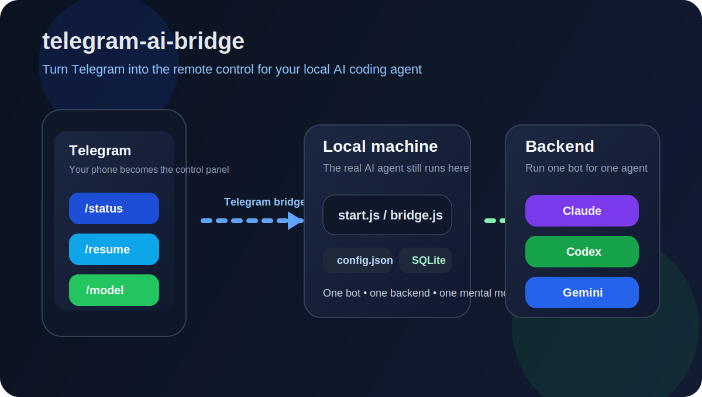

# telegram-ai-bridge

[](LICENSE)
[](https://bun.sh)
[](https://telegram.org/)

把 Telegram 变成你本地 AI 编码代理的遥控器。

`telegram-ai-bridge` 的目标很明确：让你把一个本地 AI CLI 绑定到一个 Telegram bot，这样你在手机上也能继续查看、接力和恢复本机上的编码会话。



支持的后端：

- `claude` → Claude Agent SDK，主推荐
- `codex` → Codex SDK，主推荐
- `gemini` → Gemini Code Assist API，实验兼容后端

这个项目的核心产品规则是：

> 一个 bot = 一个 backend = 一套清晰心智模型

它从一开始就不是为“聊天里来回切换后端”设计的，而是为“分 bot、分职责、分身份”设计的。

## 产品定位

这个项目并不打算做成“多通道 AI 工作台”。

如果你见过那种把 Telegram、飞书、Web UI、多 agent、仪表盘、团队流转全部揉在一起的产品，那是另一类东西。

`telegram-ai-bridge` 的选择是刻意收窄的：

| 维度 | `telegram-ai-bridge` | 多通道 AI 工作台类产品 |
| --- | --- | --- |
| 主要用户 | 个人操作者 | 团队 / 组织 |
| 核心目标 | 远程续接本地 coding session | 协调多个 agent 和多个沟通入口 |
| 交互界面 | 以 Telegram 为主 | Telegram + 飞书 + Web UI 等 |
| 运行方式 | 自托管，本地 CLI 优先 | 更像平台 / 控制平面 |
| 复杂度 | 薄桥接层 | 更大的产品面 |
| 最适合 | 个人远程控制 | 团队协作和运营管理 |

这不是短板，反而是这个项目的优势：它就是为“手机 → Telegram → 本地 AI CLI”这条最短路径优化的。

## 这个项目解决什么问题

很多“Telegram + AI”项目，本质上只是聊天壳。

这个项目不一样：

- 面向的是本地 coding agent，而不是泛聊天机器人
- 会话和凭证留在你自己的机器上，而不是伪装成云服务
- 能承接真实的 resumable agent workflow
- 默认就是 owner-only 的个人远程控制模型

如果你已经在重度使用 Claude Code 或 Codex，并想要一个真正能在手机上接力的入口，这就是它的定位。Gemini 仍可接入，但不再作为主推荐部署路径。

## 适合谁

- 桌面端或服务器上长期挂着 AI 编码会话的独立开发者
- 想用手机查看进度、续接任务的 AI 重度用户
- 准备给不同 agent 分别配置不同 Telegram bot 的人
- 想要自托管、轻量、直接方案，而不是平台型产品的人

## 适合你，如果

- 你想把真实 AI session 保留在自己的机器上
- 你更喜欢一个 bot 对应一个 agent，而不是一个大而全的后台
- 你更看重简单、直接、清晰，而不是庞大的管理界面
- 你要的是个人工具，不是团队协作套件

## 你能得到什么

- 统一启动入口：`bun run start --backend <name>`
- 初始化脚手架：`bun run bootstrap --backend <name>`
- 交互式初始化向导：`bun run setup`
- 内置配置和依赖自检：`bun run check --backend <name>`
- 用 `config.json` 管理配置，不再到处散落硬编码路径
- SQLite 持久化 session
- 任务状态持久化，可跟踪审批和最近执行记录
- owner-only 权限模型
- 支持列出、预览、恢复会话和切换模型
- 已抽象执行器层，支持 `direct` 和 `local-agent` 两种模式
- Docker 也走同一套运行方式
- 已补 Bun 测试，并接入 GitHub Actions CI
- 兼容旧 `.env*` 配置，便于平滑迁移
- 保留 Gemini 兼容入口，但产品主路径明确收敛到 Claude / Codex

## 快速开始

```bash
git clone https://github.com/AliceLJY/telegram-ai-bridge.git
cd telegram-ai-bridge
bun install
bun run bootstrap --backend claude
bun run setup --backend claude
bun run check --backend claude
bun run start --backend claude
```

如果你习惯 npm，也可以把它作为壳来调用；前提仍然是本机已安装 Bun：

```bash
npm start -- --backend claude
```

## 推荐部署模型

最推荐的方式是：不同 agent 用不同 bot。

例如：

- `@your-claude-bot` → 只连 Claude
- `@your-codex-bot` → 只连 Codex

如果你明确需要兼容模式，也可以额外配：

- `@your-gemini-bot` → 只连 Gemini

这样做的好处：

- 用户永远知道自己在和哪个 agent 对话
- bot 命名、预期和行为都更清晰
- 权限和凭证边界更容易管理
- 文档、setup 和支持成本都更低

## 30 秒理解运行方式

```text
Telegram bot
  -> start.js
  -> config.json
  -> bridge.js
  -> executor
  -> 一个 backend adapter
  -> 你的本地凭证和 session 文件
```

每个 bot 实例都会保有自己独立的：

- Telegram bot token
- SQLite DB 文件
- Task DB 文件
- 本地凭证目录
- 模型 / 鉴权配置

## 配置

### 推荐：`config.json`

最快路径：

```bash
bun run bootstrap --backend claude
bun run setup --backend claude
```

向导会提示你填写：

- `OWNER_TELEGRAM_ID`
- 公共工作目录和可选代理
- 每个独立 bot 对应的 Telegram token
- 各后端自己的模型 / DB 设置
- 只有在你显式启用 Gemini 兼容后端时，才需要填 Gemini OAuth 配置

可以先参考 `config.example.json`。

`bootstrap` 会生成一个起步版 `config.json`，并创建本地 `files/` 目录。如果你更喜欢手动维护配置，也仍然可以直接复制 `config.example.json`。

### 示例配置

```json
{
  "shared": {
    "ownerTelegramId": "123456789",
    "cwd": "/Users/you",
    "httpProxy": "",
    "defaultVerboseLevel": 1,
    "executor": "direct",
    "tasksDb": "tasks.db"
  },
  "backends": {
    "claude": {
      "enabled": true,
      "telegramBotToken": "...",
      "sessionsDb": "sessions.db",
      "model": "claude-sonnet-4-6",
      "permissionMode": "default"
    },
    "codex": {
      "enabled": true,
      "telegramBotToken": "...",
      "sessionsDb": "sessions-codex.db",
      "model": ""
    },
    "gemini": {
      "enabled": false,
      "telegramBotToken": "",
      "sessionsDb": "sessions-gemini.db",
      "model": "gemini-2.5-pro",
      "oauthClientId": "",
      "oauthClientSecret": "",
      "googleCloudProject": ""
    }
  }
}
```

`config.json` 已加入 `.gitignore`，本地 secret 不会被误提交。

### 兼容旧 `.env`

如果没有 `config.json`，CLI 仍兼容：

- `claude` → `.env` 或 `.env.claude`
- `codex` → `.env.codex`，并可叠加 `.env`
- `gemini` → `.env.gemini`，并可叠加 `.env`

这只是为了兼容旧部署。新安装方式建议直接使用 `config.json`。

## 运行

启动单个 bot 实例：

```bash
bun run start --backend claude
bun run start --backend codex
```

如果你明确要启用 Gemini 兼容模式，再单独运行：

```bash
bun run start --backend gemini
```

现有脚本只是统一入口的薄包装：

```bash
./start-claude.sh
./start-codex.sh
./start-gemini.sh
```

查看最终生效配置：

```bash
bun run config --backend claude
```

输出会自动隐藏敏感字段。

启动前建议先跑一次本地自检：

```bash
bun run check --backend claude
```

它会校验当前后端配置、必要路径，并在本地 CLI 登录状态缺失时给出 warning。

## Telegram 命令

| 命令 | 说明 |
| --- | --- |
| `/new` | 新建会话 |
| `/sessions` | 查看最近会话 |
| `/peek <id>` | 只读预览某个会话 |
| `/resume <id>` | 把当前聊天重新绑定到已拥有会话 |
| `/model` | 切换当前 bot 实例的模型 |
| `/status` | 查看实例后端、模型、工作目录和会话状态 |
| `/tasks` | 查看当前聊天的最近任务记录 |
| `/verbose 0|1|2` | 调整进度输出详细度 |

## 执行模式

- `direct`：默认模式，bridge 进程内直接调用 backend adapter
- `local-agent`：bridge 通过 JSONL stdio 与本地 agent 子进程通讯

可在 `config.json` 的 `shared.executor` 中设置，也可以用 `BRIDGE_EXECUTOR` 覆盖。

## 后端说明

### Claude

- 需要本地 Claude 登录状态，目录位于 `~/.claude/`
- 支持 `permissionMode`：`default` 或 `bypassPermissions`

### Codex

- 需要本地 Codex 登录状态，目录位于 `~/.codex/`
- `model` 可留空，表示使用 Codex 默认模型

### Gemini

- 实验兼容后端，不是当前产品主推荐路径
- 需要 `~/.gemini/oauth_creds.json`
- 需要 `oauthClientId` 和 `oauthClientSecret`
- 可选 `googleCloudProject`
- 当前接的是 Gemini Code Assist API 模式，不是完整 Gemini CLI 终端控制
- 只有在你明确需要 Gemini 这条链路时再启用；默认推荐走 Claude / Codex

## Docker

构建镜像：

```bash
docker build -t telegram-ai-bridge .
```

运行 Claude bot：

```bash
docker run -d \
  --name tg-ai-bridge-claude \
  -v $(pwd)/config.json:/app/config.json:ro \
  -v ~/.claude:/root/.claude \
  telegram-ai-bridge --backend claude
```

如果改成 `codex`，替换挂载目录和 `--backend` 即可。`gemini` 仅建议在你明确要开启兼容模式时使用。

## 项目结构

- `start.js` — `start` / `bootstrap` / `check` / `setup` / `config` CLI 入口
- `config.js` — 配置加载、setup wizard、旧 `.env` 兼容层
- `bridge.js` — Telegram bot 运行时
- `sessions.js` — SQLite 会话持久化
- `adapters/` — 后端接入层

## 开发

本地运行测试：

```bash
bun test
```

GitHub Actions 会在每次 push 和 pull request 上运行同一套测试。

## Roadmap

- [x] 配置驱动启动
- [x] 单命令启动后端
- [x] 交互式 setup wizard
- [x] 更清晰的用户文档
- [ ] 更完整的 LaunchAgent 模板
- [ ] VPS / Docker / macOS 部署示例
- [ ] 更好的截图或 GIF 演示

## License

MIT
